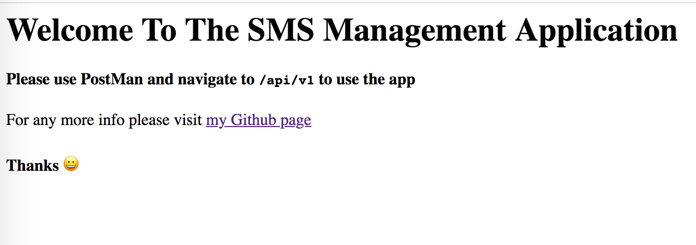

[](https://opensource.org/licenses/MIT)
[](https://travis-ci.com/benfluleck/sms-management-system)
[](https://coveralls.io/github/benfluleck/sms-management-system?branch=feat-implement-contact-controller) [](https://greenkeeper.io/)


# SMS Management Application
The SMS management application is a project inspired by my LMS Outputs for [Andela](https://andela.com/) for my D2 Assessments. The aim is a back-end javascript application that implements a simple way to send and receive SMS messages between contacts on the application

<br />
<br />




# Table of Contents

- [Getting Started](#getting-started)
- [Technology Stack](#technology-stack)
- [Installation](#installation)
- [Usage](#usage)
- [Testing](#testing)
- [API Endpoints](#api-endpoints)
- [Questions](#questions)
- [Support or Contribution](#support-or-contribution)

## Getting Started
This is a backend javascript application built with [**Node JS**](https://nodejs.org/en/) using [**Express**](https://expressjs.com/) framework. The application runs with Redis server and Express Session for security and validation of users.

## Technology Stack
**Server Side**
1. NodeJS
2. Express FrameWork

## Installation

1. Install [**Node JS**](https://nodejs.org/en/).

2. Clone the [**repository here**](https://github.com/benfluleck/random-phone-number-generator)
3. [**cd**] into the root of the **project directory**.
4. Run `yarn install` on the terminal to install project dependecies
5. Create a `.env` file in the root directory of the application. Example of the content of a .env file is shown in the .env.sample

6. Start the application:
**_Different Build Environments_**

**Production**
```
yarn build
yarn drop-migrations
yarn migrations
yarn start:prod
```
**Development**
```
yarn clean_start:dev
```
## Testing

Sever side tests - Run `yarn test` on the terminal while within the **project root directory**.

Server side testing is achieved through use of `chai-http`, `mocha` and `chai` packages. `chai-http` is used to make requests to the api and `mocha` is the testing framework and `chai` is the exception library. They will both be installed when you run `yarn install` and the tests will run when you run `yarn test`.

## API Endpoints

Please view API Documentation [here](https://bennyogidan.docs.apiary.io/#)


## Questions
For more details contact benny.ogidan@andela.com

## Support or Contribution
For any suggestions or contributions or issues please do raise them or email me.
For **Contributions**, Please clone the repo and implement a PR I would appreciate it


